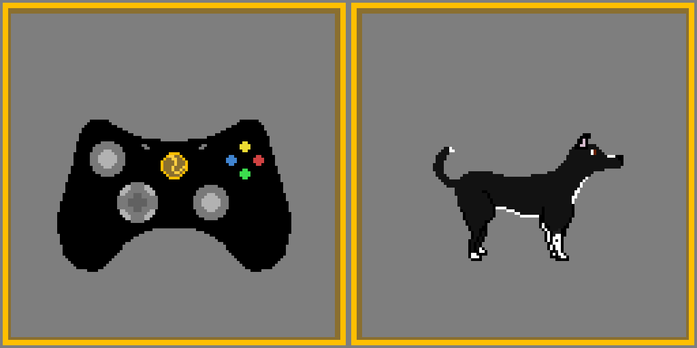
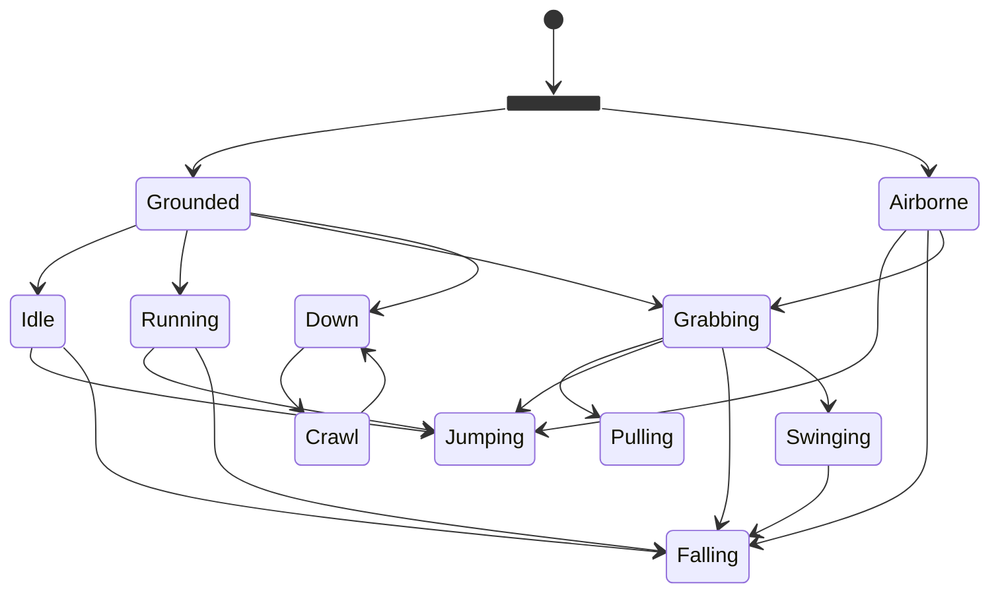
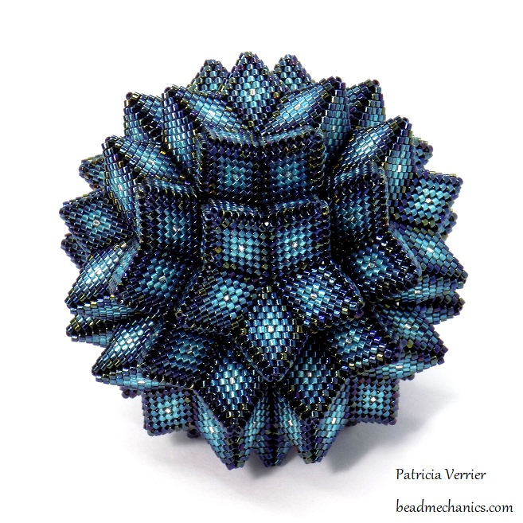
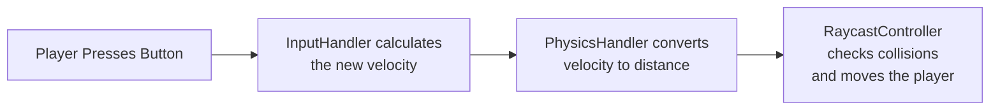

[TOC]
# Character Controllers
After a month of waiting I finally found the time to sit down and write another post. This post is going to cover *Character Controllers* in the context of a 2D platformer. After covering the basic concepts I'll walk you through the different types of controllers I've tried as well as their pros and cons.

## What is a character controller?
Before I talk about the nuances of the different types of character controllers I'd like to cover the basics of what a character controller is and what it does in the context of a 2D platformer like the Golden Tennis Ball.

A character controller, or simply a controller, refers to the code that reads button presses, clicks, joy stick input, etc, and translates those inputs into actions that the character performs.

<figure markdown="span">
  
<figcaption>Translating inputs into actions.</figcaption>
</figure>

As you can see in the above gif, Chispa performs a different action based on the different controller inputs. In 2D platformers, character controllers are everything. A poorly designed controller means that the player will spend more time fighting the controller than actually playing the game.

From a high level, character controllers are very simple. You pass an input and get an output, but there is more to it than that. How a character controller handles inputs dictates how the game *feels*.

How a game *feels* is dependent on **many** different factors like input lag, movement speed, and  gravity just to name a few. Depending on what kind of game you're making dictates what sort of features your character controller needs to implement in order to feel good. With all of this in mind, lets talk through the evolution of the Golden Tenniball's character controller.

$$
F = ma
$$

# Character Controller Basics
Before we can really get into the nitty gritty of how my controller works we need to talk about some basic computer physics things:

- Physics Loops
- Colliders
- Raycasts

Once you understand these basics everything else will click into place.

## The Physics Loop
Before we can talk about colliders and raycasts we need to talk about what a physics loop is. Most people know that games, like movies and tv shows, run a specified framerate, but unlike movies and tv shows, framerates for games can fluctuate. The framerate will change based on what is going on in the game. For example if there are a lot of objects on screen that can tank your framerate. 

Having an unsteady framerate is awful for physics calculations because the math behind the physics relies on a time consistent interval between calculations. This is where a physics loop comes in. A physics loop is where physics calculations are performed. The loop is called at a specific intervals and runs independently of the games framerate.

Within the physics loop the game calculates forces on objects, resolves collisions, and moves objects at a consistent interval. If you were to perform your physics calculations outside of the physics loop weird things would happen, like tunneling.

Tunneling is a phenomena where a solid object magically passes through another solid object like a wall or the floor. If you tied your movement and collision calculations to the framerate and it suddenly dropped, the player could tunnel through objects because in that moment they would be moving *faster* than the game could calculate collisions. To the moving player the physics calculations would say there was no object in their way, therefore, they can move forward. However, once the framerate stabilized again the player would be trapped inside the object they just passed through.

    <figure style="width: 22%;">
        
        <figcaption>Player begins moving</figcaption>
    </figure>
    <figure style="width: 22%;">
        
        <figcaption>Framerate drops</figcaption>
    </figure>
    <figure style="width: 22%;">
        
        <figcaption>Collisions can't be resolved so the player begins tunneling.</figcaption>
    </figure>
    <figure style="width: 22%;">
        
        <figcaption>Physics catches back up and traps player.</figcaption>
    </figure>

To summarize this, a physics loop performs calculations at a consistent interval. Then those calculations are used to resolve collisions and move objects around. If those calculations are not performed at a consistent interval *weird things happen*.

With the physics loop out of the way, lets talk about colliders!

## Colliders
Colliders are part of the physical representation of objects within a game. They are invisible shapes placed on game objects that define their physical boundaries. Colliders can take many shapes. They can be as simple as a circle or as complex as the Great Rhombicosidodecahedron[^1]. 

<figure markdown="span">
  
<figcaption>A bead version of the <a href="https://beadmechanics.com/2019/09/01/rhombicosidodecahedron-hyparhedron-variation/" target="_blank">Great Rhombicosidodecahedron</a>.
</figcaption>
</figure>

Granted if you made something that complicated your computer might have trouble calculating it's physical properties. This shape has 62 faces, 60 vertices, and 120 edges and with the physics loop firing every 50 ms your CPU might start to beg for mercy.

Colliders allow for realistic simulations of objects within a game. They provide boundaries that describe an objects position in space and prevent objects from overlapping one another. Without colliders, all objects would simply pass through one another. Colliders can move, like the player's collider, or they can be stationary, like the floor. 

The most important job for a collider is **collision detection**. Collision detection is the act of checking what objects are touching one another. Collision detection can be expanded to determine what specific objects are touching, where relative to each other they are touching, and how hard the objects collided when they began touching. All of which is very important when you want build a physics based game!

## Raycasts
Raycasts are a type of physics query used to detect colliders along a path. Think of a raycast as a laser that detects objects it is pointed at. 

A raycast is a type of shape-cast. Shape-casts are physics queries that use shapes shot along a given path to detect objects. A raycast is called a **ray**cast because the shape generated is a one pixel wide ray. The images below will hopefully clear up this concept.

    <figure style="width: 75%;">
        
        <figcaption>Raycast - a single point projected along a path.</figcaption>
    </figure>
    <figure style="width:75%;">
        
        <figcaption>Circle cast - a circle projected along a path.</figcaption>
    </figure>
    <figure style="width:75%;">
        
        <figcaption>Square cast - a square projected along a path.</figcaption>
    </figure>

When a raycast (or any shape cast) collides with an object it returns information like the objects, distance from where the cast began, the speed of the object, and more! 

Now that we've covered the basics of character controllers and game physics; we can finally talk about the character controller for the Golden Tennis Ball.

# The Golden Tennis Ball's Character Controller.
Now we can talk about the Golden Tennis Ball's character controller. The controller has been redesigned from the ground up four different times before finally settling on the current configuration. The way the controller works is simple. 
1. The player gives an input to the controller. 
2. The controller converts that input into a speed and direction. 
3. The controller checks for obstacles.
4. Then the player is moved.

### The Input/Output Model
There are three scripts that control movement for the character. The `InputHandler`, `PhysicsHandler`, and the `RaycastController`. The `InputHandler` reads player inputs and calculates then player's requested velocity. The `PhysicsHandler` takes the requested velocity, converts it into a distance. The `RaycastController` determines if the player can move.

The flow of data through the controller always flows from the `InputHandler` to the `PhysicsHandler` resulting in a simple input/output relationship.

Getting the inputs from the player is the easy part. I used Unity's new event system to broadcast events whenever the player presses a button or moves the joystick. Converting those inputs from a velocity to a distance is the strange part.

### Converting Velocity to Position Change
You might be wondering, “why are we converting a velocity to a position?” and that is a valid question. 

We convert velocity to position change because of the method we use to move our player, `Translate()`. The `Translate()` method takes a change in position and moves an object that distance. `Translate()` is called in the physics loop of the game so that in each physics step the player moves a set distance based off of the player's velocity.

So how do we convert the velocity to a change in position? By multiplying it by the physics loops step interval. Remember from physics that velocity is the change in position divided by the time.
$$
V = \frac{dx}{dt}
$$
Therefore, we to get the change in position we can modify the equation to be:
$$
dx = Vt
$$
Where:
- V is the current velocity
- t is the time between physics steps
  
We can even extend this further to handle accelerations:
$$
a = \frac{δx}{dt^2}
$$
Which becomes:
$$
dx = at^2
$$

In practice 

We convert the velocity to position because the game’s physics loop runs in discrete steps, and in each step or tick, all of the objects—including the player—have one well-defined position. Think of it like watching an animation frame by frame: where each frame is one physics step. During a physics step, the game engine treats objects as being at fixed positions while it performs the calculations needed to advance the simulation, determining their new positions and velocities by the end of that step.

## Talk about Unity's `Translate` method
## How by defining a velocity we're actually calculating a position change
## How this setup lends itself to being used in a physics manager
## Why scriptable objects are amazing

## Maybe next time I will talk about game feel and some of the math behind it.

[^1]:
    According to google, and apparently math, this is the most complicated shape there is. Here's a [link](https://polytope.miraheze.org/wiki/Great_rhombicosidodecahedron){target="_blank"}!

