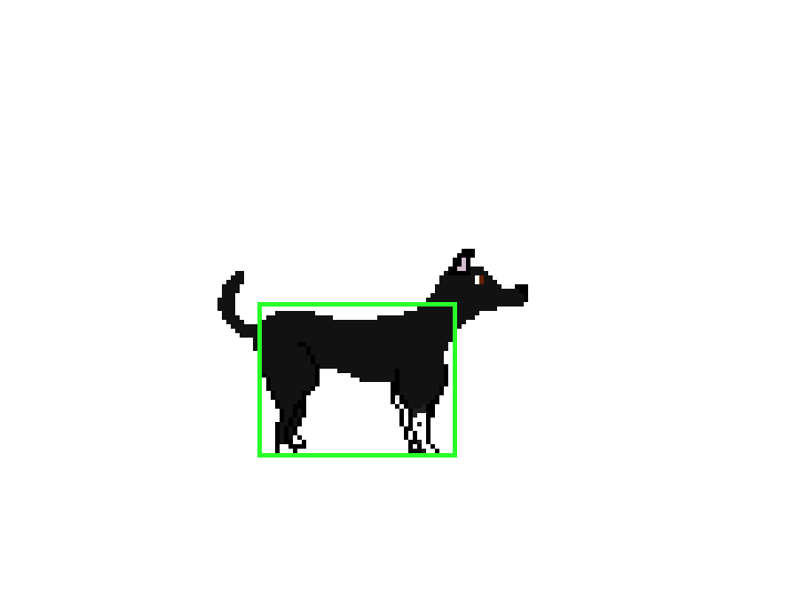

[TOC]
By now you might be wondering, if having complicated physical shapes is expensive in terms of computing power, how do games do it? The answer: they don't! Usually colliders only *approximate* the shape of object the player sees. This is done for two reasons:

1. It's easier on the computer and generally accurate *enough*.
2. It helps the player.

<figure markdown="span">
  
<figcaption>Chispa's collider.
</figcaption>
</figure>

The above image is Chispa's actual collider. Notice how it only covers her body; Chispa's head and tail don't collide with anything. This means that if a rogue tennis ball collides with Chispa's head or tail it won't do anything! This is what I mean when I saw that approximating the shape of the character *helps* the player. Having a smaller collider helps the player move around the world without getting caught on things and makes it harder for enemies to hurt them. In fact developers usually **undersize** colliders for things that can hurt the player. This makes the game feel more fair. Instead of taking damage when a hazard barely touches you, the hazard needs to have a direct hit to hurt the player.

<figure markdown="span">
  
<figcaption>A spike collider. Note that the player can actually touch the tips of the spikes without taking damage.
</figcaption>
</figure>
