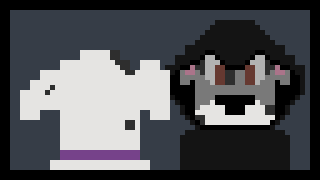

# 2026-01-03

Hi there, long time no see! This devlog is devoted to the journey of building my first game, *The Quest for the Golden Tennis Ball*. Now I know that I said the next post would be about character controllers, but that post proved to be *quite* the challenge. My goal is to make these posts fun and accessible. You shouldn't need a degree in engineering to read about your favorite pups! 

As a result, the character controller post needs a rewrite and will likely be broken up into multiple different posts. The nuance of designing a *good* character controller is **very** technical.

## What's New?

So besides not posting sooner, what have the girls and I been up to? Well right before Thanksgiving, we released the latest build of the game, version 0.2.1.0. Some of the highlights of this version include:

- A brand new level
- A revamped character controller
- Hazards
- New music
- Improved camera work

Now before you get too excited, there is a dark side to this update...

<figure markdown="span">
  
<figcaption>Lola meets confronts her dark side.</figcaption>
</figure>

## The Dark Side
Despite having been working on this project now for over a year, I have been so busy adding and removing features, tweaking things, drawing, and composing that I have neglected *testing*. Sure, I've played the game, a lot, but when I play the game it is more to test out the feel and ensure features are working. It isn't that structured. While I'm able to check things like button presses and door triggers easily, I'm not always looking for the more subtle problems.

As a result, this latest build is FULL of bugs, which is why I haven't told many people about it. Some of the bugs include:

- Only dying to spikes once.
- Going out of bounds has no effect.
- The game soft locks if you quit to the main menu.
- Music randomly loops.
- Points and dinosaurs don't update in the HUD.
- The timer is visible and doesn't do anything.
- Starting the music causes a huge lag spike.
- One of the platforms [Rocks You Like A Hurricane](https://www.youtube.com/watch?v=6yP1tcy9a10&list=RD6yP1tcy9a10&start_radio=1){target="_blank"}!

<p style="font-size:24px;">And these are just the bugs that I <strong>know about</strong>.</p>

<figure markdown="span">
  
<figcaption>Ian confused about how things could get worse.</figcaption>
</figure>

If you've never written code before you might be thinking "wow, the girls should hire a new dev," but issues like this are actually expected. Granted *this* many bugs shouldn't reach the player, but this is a one man and two dog show! The girls can only audit so much code.

<figure markdown="span">
  
<figcaption>Chispa reviewing my latest pull request.</figcaption>
</figure>

## The Fix
Ever since these bugs came to light, I've been working out how to fix them, and more importantly prevent them from happening again. The answer? **Testing**. Testing in software development means writing code to exercise different parts of your code and verify that it works. Tests are great because they're automated and repeatable. I can spend the day working on the game and then run my tests overnight to figure out what's broken. Right now I am focused on three types of testing: unit testing, integration testing, and regression testing.

### Unit Testing
Unit testing is the act of exercising small parts of your code to verify that each *unit* works as intended. In unit testing you are concerned with how each method works on its own **not** how the methods work together as a whole. For example say you had two functions that work together to make the player jump.
```c#
public void GetJumpButtonPress()

public void AddJumpForce()
```

`GetJumpButtonPress()` detects if the jump button was pressed and `AddJumpForce()` applies a force to move the player vertically. Together, these methods produce a jump, but individually they perform specialized actions. Unit testing would test that `GetJumpButtonPress()` accurately receives jump button presses and that `AddJumpForce()` applies a vertical force to the player. Notice that neither one of these tests actually check if the player jumped. Their only concern is how each individual method works. Testing how methods work together is reserved for integration testing.

### Integration Testing

Integration testing tests how different units of code work together. In a sense it tests the connections between different methods and verifies that the end result is what we expect. In the above example we saw how unit tests verify that individual parts of our code work **independently**. An integration test would verify that the different parts of our code work **together**. Using the above jump example, integration testing would be used to verify that `GetJumpButtonPress()` and `AddJumpForce()` work together to produce a jump.

### Regression Testing

The joke in software engineering is that the best way to break your code is to fix it. What do I mean by that? Well no matter how much you try and decouple[^1] a program there is still going to be some level of coupling. Everything has to rely on *something*. So if you fix a bug in one part of your code, there is a non-zero chance that you wind up breaking a different part of your code with that "fix." This is where regression testing comes in.

Regression testing is the act of rerunning tests after you change something. The goal is to keep your program from moving backwards, from **regressing**. Regression testing is usually a part of a CI/CD pipeline[^2]. When your code is ready for release, the CI/CD pipeline will run the tests you have previously written to verify that your new features don't break your old ones.

## So What's Going On?
Right now the game has a lot of personality, too much personality for my taste. So I'm reorganizing my code into more manageable pieces and setting up an actual build-test workflow for the game. This reorganization **needs** to happen and I have been putting it off for a long time now. Once my CI/CD pipeline is running tests and not just building the game, I'll be able to release the fixes for the current version. 

In the meantime, be on the look out for lore posts! I plan to write up a profile for each of the characters in the game to help build out the world.

As for now, thanks for reading! You're welcome to play the current build of the game if you want, just know it might be frustrating. If you don't have access to the latest build and would like to join my freelance play test group send me an [email](mailto:goldentennisballofficial@gmail.com)!

[^1]:
    Decoupling in software development is the act of reducing how much one object depends on another.

[^2]:
    A CI/CD pipeline or a continuous integration/continuous deployment pipeline is a workflow for building and releasing software. A CI/CD pipeline is used for testing, building, and deploying software in a repeatable way.